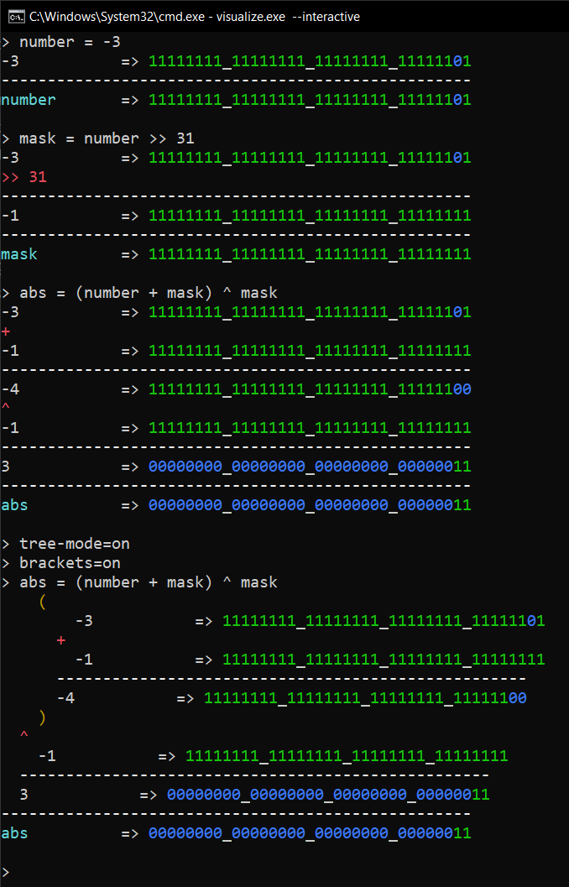

# "Tech-Talk: Branchless Programming"

Slides, sources and material for my talk at _2022-11-25 @ FHDW Hannover_

--- 

Copyright (c) 2022 by Frederik Höft. All rights reserved.

---

### Bit Operation Visualizer

A simple .NET 7 console application to visualize bit operations can be found in [Releases](https://github.com/frederik-hoeft/talks-branchless-programming/releases) (AOT compiled for Windows x64).

Starting the application in interactive mode:

```console
.\visualize.exe --interactive
```

It currently supports basic variable assignment, some bit operations and printing of the current state of the variables. Operator precedence is a bit messed up, because I just couldn't be bothered and because GPT-3 didn't generate the code for it. Welp, whatcha gonna do. Just use brackets. ¯\\\_(ツ)_/¯

Example output when running the application in interactive mode:


