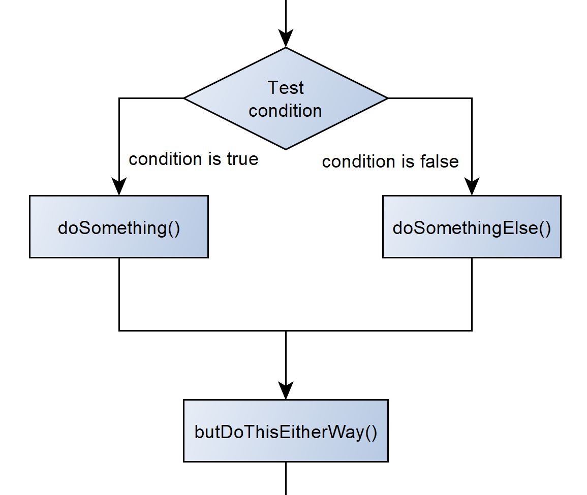
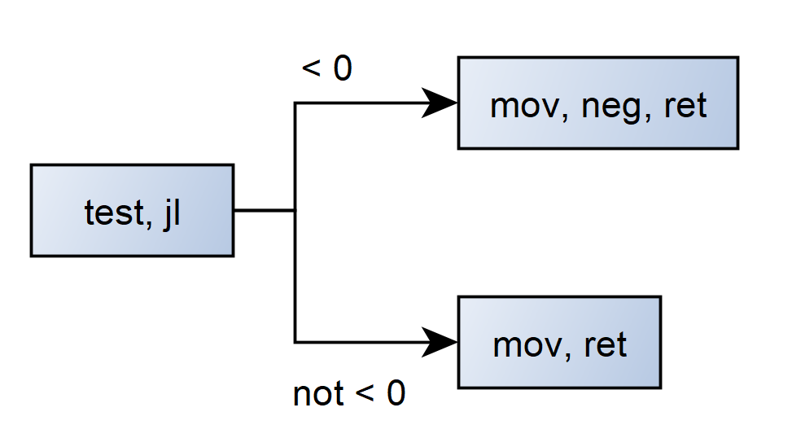

---
presentation:
  title: Branchless Programming
  description: Branchless Programming
  theme: "simple.css"
  controls: false
  slideNumber: true
  overview: true
  enableSpeakerNotes: true
  mouseWheel: true
---

@import "./global-style.less"

<!-- slide -->

# Branchless Programming

<!-- slide -->

## Agenda (TODO: does not match content)

- Intro (1 min)
- What are branches? (2 min)
- Branches: why should I care?
	- An everyday example (3 min)
	- The technical aspect (5 min)
- What branchless code can do for me (and what it can't) (3 min)
- So how does it work?
	- Basics
		- Bits and Bytes (2 min)
		- Two's complement (2 min)
		- Binary arithmetic: shifting and masking (3 min)
- Example 1: `max()` function (5 min)
- Example 2: `hexlify()` / `unhexlify()`  (4 min)
- Branchless is just the beginning (1 min)
	- Example 2 + SIMD (+GPGPU?).
- Pitfalls, Do's and Dont's (2 min)
- Conclusion (2 min)

<!-- slide -->

## Intro

About me...about whatever I'm doing today -> TODO

<!-- slide -->

## What are branches?

<table>
<tr>
<td>

```csharp
if (condition)
{
    doSomething();
}
else
{
    doSomethingElse();
}
butDoThisEitherWay();
```

</td>
<td>



</td>
</tr>
</table>

<!-- slide -->

## Cool... So what's wrong with it?

### An introductory example

<!-- slide -->

<div style="display: flex; align-items: center; justify-content: center;">
  <div style="display: grid; grid-template-rows: 40rem, auto; width: 40rem;">
    </img>
	<div style="display: flex; justify-content: end;">
      <span style="font-size: 1rem; margin-right: 2rem; font-style: italic;">"It's Friday. This is what you could be doing right now." by DALL·E (OpenAI)</span>
	</div>
  </div>
</div>

<!-- slide -->

<div style="display: flex; align-items: center; justify-content: center;">
  <div style="display: grid; grid-template-rows: 40rem, auto; width: 40rem;">
    </img>
	<div style="display: flex; justify-content: end;">
      <span style="font-size: 1rem; margin-right: 2rem; font-style: italic;">"Waiting for branch evaluation." by DALL·E (OpenAI)</span>
	</div>
  </div>
</div>

<!-- slide -->

<div style="display: flex; align-items: center; justify-content: center;">
  <div style="display: grid; grid-template-rows: 40rem, auto; width: 40rem;">
    </img>
	<div style="display: flex; justify-content: end;">
      <span style="font-size: 1rem; margin-right: 2rem; font-style: italic;">"Branch evaluated: friendship assertion failed. Reason: 'pineapple pizza'." by DALL·E (OpenAI)</span>
	</div>
  </div>
</div>

<!-- slide -->

<div style="display: flex; align-items: center; justify-content: center;">
  <div style="display: grid; grid-template-rows: 40rem, auto; width: 40rem;">
    </img>
	<div style="display: flex; justify-content: end;">
      <span style="font-size: 1rem; margin-right: 2rem; font-style: italic;">"Eliminate branches: just order everything. Also: wth is happening?" by DALL·E (OpenAI)</span>
	</div>
  </div>
</div>

<!--A house party with colored lights and around 20 people. The guests are standing shocked in front of a huge wall of pizza boxes. A rift through time and space itself opens up in the middle of the room. There are integrals and differential equations and complex mathematics in the air. digital art-->

<!-- slide -->

<div style="display: flex; align-items: center; justify-content: center;">
  <div style="display: grid; grid-template-rows: 40rem, auto; width: 40rem;">
    </img>
	<div style="display: flex; justify-content: end;">
      <span style="font-size: 1rem; margin-right: 2rem; font-style: italic;">"Consequences of branchless programming." by DALL·E (OpenAI)</span>
	</div>
  </div>
</div>

<!--A software engineer wearing a suit and a tie has found his peace living in a remote hut in the mountains. Surrounded by nature he walks into the woods never to be seen again. digital art-->

<!-- slide -->

### For real: <br> what _is_ "branchless programming"?

- advanced optimization technique for low-level code
  - _"making things faster"_
- Eliminate branches in `if`, `switch` statements.
	- *not* loops (`while`, `for`, ...) $\implies$ "loop unrolling"

Let's see why branches can be slow...

<!-- slide -->

### How does it work?

#### Our code:

```csharp
int AbsoluteOf(int number)
{
    if (number >= 0) // condition
    {
        return number; // option 1
    }
    else
    {
        return number * (-1); // option 2
    }
}
```

<!-- slide -->

#### What the CPU sees:

<table>
<tr>
<td>

```csharp
int AbsoluteOf(int number) 
{
    if (number >= 0) // condition
    {
        return number; // option 1
    }
    else
    {
        return number * (-1); // option 2
    }
}
```

</td>
<td>

```c
// result is eax
// number is edx
AbsoluteOf(Int32)
    L0000: test edx, edx // condition
    L0002: jl short L0007
    L0004: mov eax, edx // option 1
    L0006: ret
    L0007: mov eax, edx // option 2
    L0009: neg eax
    L000b: ret
```

</td>
</tr>
</table>

$\implies$ instructions: `test, jl, mov, ret, mov, neg, ret`

<!-- slide -->

### What the CPU does

You won't believe these 4 simple steps to execute an instruction:

1. Instruction Fetch (IF) _"Give me an instruction"_
2. Instruction Decode (ID) _"K thx. So what do I need to do?"_
3. Execute (EX) _"Ah okay. I'm doing it."_
4. Write back (WB) _"Yay I did it. Here's the result."_ :)
- Repeat...

| time | | IF | $\rightarrow$ | ID | $\rightarrow$ | EX | $\rightarrow$ | WB |
|-|-|-|-|-|-|-|-|-|
1t | | `mov`
2t | |  | | `mov`
3t | |  | |  | | `mov`
4t | |  | |  | |  | | `mov`

<!-- slide -->

### Pipelining

Just process multiple instructions at once:

instructions: `mov, add, mov, sub, ...`

| time | | IF | $\rightarrow$ | ID | $\rightarrow$ | EX | $\rightarrow$ | WB |
|-|-|-|-|-|-|-|-|-|
1t | | `mov`
2t | | `add` | | `mov`
3t | | `mov` | | `add` | | `mov`
4t | | `sub` | | `mov` | | `add` | | `mov`

<!-- slide -->

### Back to our example

<table>
<tr>
<td>

```c
AbsoluteOf(Int32)
    L0000: test edx, edx // condition
    L0002: jl short L0007
    L0004: mov eax, edx // option 1
    L0006: ret
    L0007: mov eax, edx // option 2
    L0009: neg eax
    L000b: ret
```

</td>
<td>

$\implies$

</td>
<td>



</td>
</tr>
</table>

<div style="font-size:1.5rem">

| time | | IF | $\rightarrow$ | ID | $\rightarrow$ | EX | $\rightarrow$ | WB |
|-|-|-|-|-|-|-|-|-|
1t | | `test`
2t | | `jl` | | `test`
3t | | 😴 | | `jl` | | `test`
4t | | 😴 | | 😴 | | `jl` | | `test`

</div>

$\implies$ Pipeline stall: wait for branch evaluation!

<!-- slide -->

## Branch elimination


<table>
<tr>
<td>Branching</td><td>Branchless</td>
</tr>
<tr>
<td>

```csharp
int AbsoluteOf(int number) 
{
    if (number >= 0) // condition
    {
        return number; // option 1
    }
    else
    {
        return number * (-1); // option 2
    }
}
```

</td>
<td>

```csharp
Int32 AbsoluteOf(Int32 number) 
{
    Int32 mask = (number >> 31);
    return number * (mask | 1);
}
```

```csharp
Int32 AbsoluteOf(Int32 number) 
{
    Int32 mask = (number >> 31);
    return (number + mask) ^ mask;
}
```

</td>
</tr>
</table>

_"Yeah, cool... But what is happening here?"_

<!-- slide -->

### Two's complement

How are negative numbers stored?

<div style="font-size: 1.4rem">

| positive decimal | positive binary | | negative binary | negative decimal |
-|-|-|-|-
$10^0$ | $2^32^2\ 2^12^0$ |\||  $-2^32^2\ 2^12^0$ | $-10^0$
$\ \ 0$ | $0\ \ 0\ \ 0\ \ 0$ |\|| $\ \ \ 0\ \ 0\ \ 0\ \ 0$ | $-\ \ 0$
$\ \ 1$ | $0\ \ 0\ \ 0\ \ 1$ |\|| $\ \ \ 1\ \ 1\ \ 1\ \ 1$ | $-\ \ 1$
$\ \ 2$ | $0\ \ 0\ \ 1\ \ 0$ |\|| $\ \ \ 1\ \ 1\ \ 1\ \ 0$ | $-\ \ 2$
$\ \ 3$ | $0\ \ 0\ \ 1\ \ 1$ |\|| $\ \ \ 1\ \ 1\ \ 0\ \ 1$ | $-\ \ 3$
$\ \ 4$ | $0\ \ 1\ \ 0\ \ 0$ |\|| $\ \ \ 1\ \ 1\ \ 0\ \ 0$ | $-\ \ 4$
$\ \ 5$ | $0\ \ 1\ \ 0\ \ 1$ |\|| $\ \ \ 1\ \ 0\ \ 1\ \ 1$ | $-\ \ 5$
$\ \ 6$ | $0\ \ 1\ \ 1\ \ 0$ |\|| $\ \ \ 1\ \ 0\ \ 1\ \ 0$ | $-\ \ 6$
$\ \ 7$ | $0\ \ 1\ \ 1\ \ 1$ |\|| $\ \ \ 1\ \ 0\ \ 0\ \ 1$ | $-\ \ 7$
$\ \ 8$ | $----$ |\|| $\ \ \ 1\ \ 0\ \ 0\ \ 0$ | $-\ \ 8$

</div>

$\implies x \cdot (-1) = x - 1$, then invert bits.

<!-- slide -->

## Binary arithmetic


<table>
<tr>
<td>

|  | or: `|` |
-:|:-
|  | 1001 |
| `|` | 0011 |
|=| 1011 |

</td>
<td>

|  | and: `&` |
-:|:-
|  | 1001 |
| `&` | 0011 |
|=| 0001 |

</td>
<td>

|  | xor: `^` |
-:|:-
|  | 1001 |
| `^` | 0011 |
|=| 1010 |

</td>
</tr>
</table>

<table>
<tr>
<td>

|  | flip bits: `~` |
-:|:-
| `~` | 1001 |
| = | 0110 |

</td>
<td>

|  | signed shift right by x: `>>x`|
-:|:-|:- 
| | 1001 `>>2` | 
|=| 1110 |

</td>
</tr>
</table>

<!-- slide -->

### Back to our example

<table>
<tr>
<td>

```csharp
Int32 AbsoluteOf(Int32 number) 
{
    Int32 mask = (number >> 31);
    return number * (mask | 1);
}
```

</td>
<td style="font-size: 1.5rem">

- `Int32` $\implies$ 32 bit signed integer
- `>> 31` $\implies$ signed bit-shift right by 31 bits.
- `| 1` $\implies$ "or 1"

</td>
</tr>
</table>
<div style="font-size: 1.5rem">
Let's test this.
<table>
<tr>
<td style="font-size: 1.25rem">

What if number = 5?
- number = 5 = 0 $\dots$ 0101b
- mask = 0 $\dots$ 0b = 0
- (mask | 1) = 0 $\dots$ 0b | 0 $\dots$ 1b = 1
- number * (mask | 1) = 5 * 1 = 5

</td>
<td style="font-size: 1.25rem">

What if number = -3?
- number = -3 $\implies$ 1 $\dots$ 1101b
- mask = 1 $\dots$ 1b = -1
- (mask | 1) = 1 $\dots$ 1b | 0 $\dots$ 1b = 1 $\dots$ 1b = -1
- number * (mask | 1) = -3 * (-1) = 3

</td>
</tr>
</table>

Aha, so it is calculating 
- number * (0 | 1) = number * 1, if number is positive
- number * (-1 | 1) = number * -1, if number is negative
</div>

<!-- slide -->

What about the other version?

<table>
<tr>
<td>

```csharp
Int32 AbsoluteOf(Int32 number) 
{
    Int32 mask = (number >> 31);
    return (number + mask) ^ mask;
}
```

</td>
<td style="font-size: 1.5rem">

- `Int32` $\implies$ 32 bit signed integer
- `>> 31` $\implies$ copy sign bit 31 times.
- `^` $\implies$ "xor"
- `mask` will be 0 (all 0) or -1 (all 1).

</td>
</tr>
</table>
<div style="font-size: 1.5rem">
Let's test this.
<table>
<tr>
<td style="font-size: 1.25rem">

What if number = 5?
- 5 is positive, so mask will be 0.
- number + mask = 5 + 0 = 5
- 5 ^ mask = 5 ^ 0
- xor all 0s does nothing
- $\implies$ 5 ^ 0 = 5

</td>
<td style="font-size: 1.25rem">

What if number = -3?
- -3 is negative, so mask will be -1 (all bits set to 1).
- number + mask = -3 + (-1) = -4
- -4 ^ mask = -4 ^ (-1)
- xor all 1s inverts all bits
- $\implies$ -4 ^ (-1) = ~(-4) = ~1 $\dots$ 100b = 0 $\dots$ 011b = 3

</td>
</tr>
</table>

Aha, so if number is negative it returns number - 1, then inverts all bits 
$\implies$ Two's complement!

</div>

<!-- slide -->

## So is branchless really faster?

Let's do a benchmark! 

<table>
<tr>
<td>

```csharp
int Abs(int number) 
{
    if (number >= 0) // condition
    {
        return number; // option 1
    }
    else
    {
        return number * (-1); // option 2
    }
}
```

</td>
<td>

```csharp
int AbsBranchless(int number) 
{
    int mask = (number >> 31);
    return (number + mask) ^ mask;
}
```

```csharp
int BuiltInMathAbs(int number) 
{
    return Math.Abs(number);
}
```

</td>
</tr>
</table>

<!-- slide -->

### Benchmark results

<div style="font-size: 1.5rem">

|         Method |      Mean |     Error |    StdDev | Ratio | RatioSD |
|--------------- |----------:|----------:|----------:|------:|--------:|
|            `Abs` | 18.110 us | 0.2077 us | 0.1943 us |  1.00 |    0.00 |
|  `AbsBranchless` |  6.995 us | 0.1191 us | 0.1114 us |  0.39 |    0.01 |
| `BuiltInMathAbs` | 20.578 us | 0.2992 us | 0.2652 us |  1.14 |    0.02 |

$\implies$ `AbsBranchless()` is ~2.5 times faster (and more stable) than `Abs()` with branches!
_Also: C# / .NET 7's `System.Math.Abs()` seems to be pretty slow_

</div>

<!-- slide -->

### Branchless is just the beginning

Branchless programming translates conditional logic into arithmetic!
Can be further optimized using more advanced techniques:

- SIMD (Single instruction, multiple data) / vector arithmetic
- ILP (Instruction-Level-parallelism)
- GP-GPU (General purpose GPU computation)

<!-- slide -->

### Pitfalls, Do's and Dont's

<table style="font-size: 1.25rem">
<tr>
<td>Do</td><td>Don't</td>
</tr>
<tr>
<td>

- **Do** always benchmark your changes
- **Do** consider using branchless code in low-level scenarios, such as
	- cryptography
	- audio / video processing
	- game development (i.e. physics simulations)
- **Do** consider eliminating branches in
	- tight loops
	- functions that are called very frequently
- **Do** always write comments!

</td>
<td>

- **Don't** just start optimizing code without a baseline benchmark.
- **Don't** be the guy writing branchless code in high-level scenarios, such as 
	- database management
	- web request handling
	- a couple of microseconds won't matter...
- **Don't** write branchless code in places that must be maintained by multiple people or are changed frequently. Everyone will hate you...
- **Don't** assume your code is translated 1:1 into assembly. Always check what your compiler generates!
- **Don't** write branchless code in interpreted languages (JavaScript, Python, ...) it won't matter.

</td>
</tr>
</table>

<!-- slide -->

### Useful in 1% of the cases

```csharp
[MethodImpl(MethodImplOptions.AggressiveInlining)]
private static bool TryParseMpegHeader(void* pFrame)
{
    const uint FALSE = 0x0;
    const uint TRUE = ~FALSE;
    // extract frame header and inline buffer from pFrame
    Mp3FrameHeader* self = &((Mp3Frame*)pFrame)->Header;
    byte* pHeaderBytes = (byte*)pFrame;
    // assume success if nothing fails: (~0x0)
    int success = unchecked((int)TRUE);
    // load the MPEG version from the header
    MpegVersion mpegVersion = (MpegVersion)((pHeaderBytes[1] & 0b0001_1000u) >> 3);
    // if the mpegVersion is reserved (invalid) set success to FALSE (0x0)
    // use sign extension to convert to either 0x0 or ~0x0 (FALSE or TRUE)
    success &= (-(int)(mpegVersion ^ MpegVersion.Reserved)) >> 31;
    // determine the version index of the BitRates array using the mpegVersion.
    // if the mpegVersion is Version1 then the version index should be 0 otherwise it is 1.
    // Enum member MpegVersion.Version1 has the value 3 (11 in binary).
    // any other possible value is 1 or 2 (01 or 10 in binary).
    // -> if both bits are equal (1 and 1) then the version index is 0 otherwise it is 1.
    // -> first bit XOR second bit
    // if both bits are zero (0) then the success flag will be set to FALSE already and the data is discarded anyways.
    int versionIndex = ((int)mpegVersion & 0b01) ^ (((int)mpegVersion & 0b10) >> 1);
    // load the MPEG layer information from the header
    MpegLayer mpegLayer = (MpegLayer)((pHeaderBytes[1] & 0b0000_0110u) >> 1);
	...
```

<!-- slide -->

### In conclusion...

```csharp
// secured my job :)
internal static bool IsValidMp3Header(void* pFrame) => 
    (unchecked((int)TRUE) & ((-(int)((MpegVersion)((((byte*)pFrame)[1] & 0x18) >> 3
    ) ^ MpegVersion.Reserved)) >> 31) & ((-(int)(MpegLayer)((((byte*)pFrame)[1] &
    0x06) >> 1)) >> 31) & (-((((byte*)pFrame)[2] & 0xF0) >> 4 ^ 15) >> 31) & 
    (-BitRates[((int)(MpegVersion)((((byte*)pFrame)[1] & 0x18) >> 3) & 0b01) ^ 
    (((int)(MpegVersion)((((byte*)pFrame)[1] & 0x18) >> 3) & 0b10) >> 1), (int)
    (MpegLayer)((((byte*)pFrame)[1] & 0x06) >> 1), (((byte*)pFrame)[2] & 0xF0) >> 4
    ] >> 31) & (-((((byte*)pFrame)[2] & 0xF0) >> 4 ^ 3) >> 31) & (~((-(int)
    ((ChannelMode)((((byte*)pFrame)[3] & 0xC0) >> 6) ^ ChannelMode.JointStereo) >>
    31) & (-((((byte*)pFrame)[3] & 0x30) >> 4) >> 31))) & (~((MAX_FRAME_SIZE - 
    ((((SamplesPerFrame[((int)(MpegVersion)((((byte*)pFrame)[1] & 0x18) >> 3) & 
    0b01) ^ (((int)(MpegVersion)((((byte*)pFrame)[1] & 0x18) >> 3) & 0x2) >> 1), 
    (int)(MpegLayer)((((byte*)pFrame)[1] & 0x06) >> 1)] >> 3) * BitRates[((int)
    (MpegVersion)((((byte*)pFrame)[1] & 0x18) >> 3) & 0x1) ^ (((int)(MpegVersion)
    ((((byte*)pFrame)[1] & 0x18) >> 3) & 0b10) >> 1), (int)(MpegLayer)((((byte*)
    pFrame)[1] & 0x06) >> 1), (((byte*)pFrame)[2] & 0xF0) >> 4] / SampleRates
    [(int)(MpegVersion)((((byte*)pFrame)[1] & 0x18) >> 3), (((byte*)pFrame)[2] 
    & 0xC0) >> 2]) + ((((byte*)pFrame)[2] & 0x2) >> 1)) << (~(-(int)((MpegLayer)
    ((((byte*)pFrame)[1] & 0x06) >> 1) ^ MpegLayer.Layer1) >> 31) & 2))) >> 31))) 
    == unchecked((int)TRUE);
```